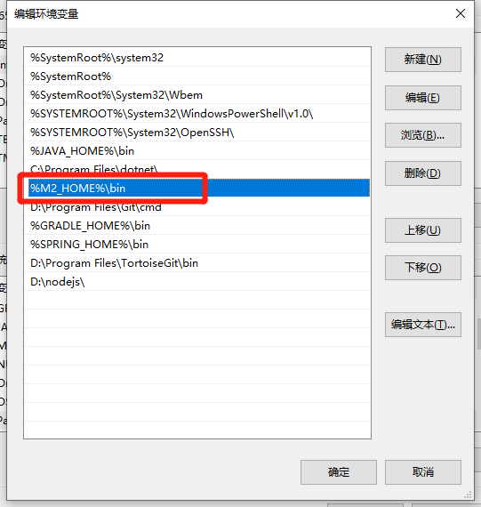

# JAVA入门

::: tip 本节基本内容
* JDK的安装
* 编写第一个程序输出Hello, World!
:::

## 一、JDK的安装和测试
### 1.JDK的安装

1.从 [https://jdk.java.net/](https://jdk.java.net/)下载jdk，这里我下载的是JDK18。 
然后解压到任意文件夹，解压后的文件夹如下图：


2.环境变量中增加JAVA_HOME,变量值为jdk解压的位置。如下图:


3.将%JAVA_HOME%\bin 添加到PATH环境变量中。如下图:


### 2.检查JDK安装是否成功

1.命令行中输入
```
java -version
``` 

如果输出如下图的jdk版本信息，则安装成功。


### 3.编写第一个程序HelloWorld
1.新建HelloWorld.java文件。
内容如下:
```java
public class HelloWorld{
    public static void main(String... args) {
        System.out.println("Hello, World!");
    }
}
```
2.在文件所在文件夹打开命令窗口,输入命令:
```
java HelloWorld.java
```
3.命令行输出打印Hello,World!


## 二、IDEA的安装和使用

### 1.IDEA的下载
1.从 [https://www.jetbrains.com/zh-cn/idea/download](https://www.jetbrains.com/zh-cn/idea/download)下载jdk
下载界面如下，这里下载社区版。


2.idea的安装
一路下一步就可以了。

## 三、maven的安装
### 1.maven的下载和解压
1.maven下载地址[https://maven.apache.org/download.cgi](https://maven.apache.org/download.cgi)
2.点击bin.zip下载

3.解压下载的压缩包(本地我的解压在 D:\JetBrains\apache-maven-3.8.6)


### 2.环境变量的配置
1.新建系统变量：MAVEN_HOME=D:\JetBrains\apache-maven-3.8.6


2.配置Path变量：%MAVEN_HOME%\bin


### 3.验证Maven环境配置是否成功
1.命令窗口输入 `mvn -version` 显示maven信息即安装成功。


### 4.配置文件修改(maven安装目录下的conf文件夹下settings.xml文件)

1. 修改本地存储位置
找到 localRepository 标签的位置,增加本地要存储的位置

```
<localRepository>D:\JetBrains\apache-maven-3.8.6\repository</localRepository>
```


2.修改阿里云镜像
在settings.xml文件中找到 `mirrors` 标签,内容修改为如下:

```
   <mirrors>
    <mirror>
      <id>alimaven</id>
        <mirrorOf>central</mirrorOf>
        <name>aliyun maven</name>
        <url>http://maven.aliyun.com/nexus/content/groups/public/</url>
      </mirror>
    <mirror>
  </mirrors>
```
配置完成后保存文件即可。

## 四、IDEA中配置JDK和maven
### 1.IDEA中配置JDK)
1.在工程中打开idea File->Ppoject Structure 快捷键(Ctrl+Alt+Shift+S)

2.选择SDK安装位置和SDK的版本

### 2.IDEA中配置JDK
1.全局配置
1)Customize->All settings

2)搜索maven,点击Maven。 配置如下：

其中
Maven home path：maven解压的目录
User settings file： settings.xml配置文件所在位置
Local repository： maven文件下载位置

2.每个工程配置
1).在工程打开idea File->Settings 快捷键(Ctrl+Alt+S)


2)接下来的步骤和全局配置中一样

## 五、IDEA中运行HelloWorld

### 1.创建工程
1.打开IDEA软件，点击New Projcet按钮。


2.输入工程名和工程存储的位置，设置JDK

其中
Name：工程名
Location： 存储位置
Language： 使用的语言
Build System： 构建工具
JDK :JDK

3.点击确定一个工程创建成功。


### 2.创建HelloWorld类文件
1.右键java这个目录->选择New选项->选择Java Class选项并点击


2.输入类名【HelloWorld】，然后回车，类创建成功


3.修改文件的代码，修改后代码如下
```java
public class HelloWorld {
    public static void main(String[] args) {
        System.out.println("Hello World");
    }
}
```

### 3.运行代码 
有两种运行方式: 
1.点击右上角如下图所示位置。
2.在要运行文件的任意位置右键，然后点击如下图所示的选项。
 

最终会在控制台打印如下结果
 